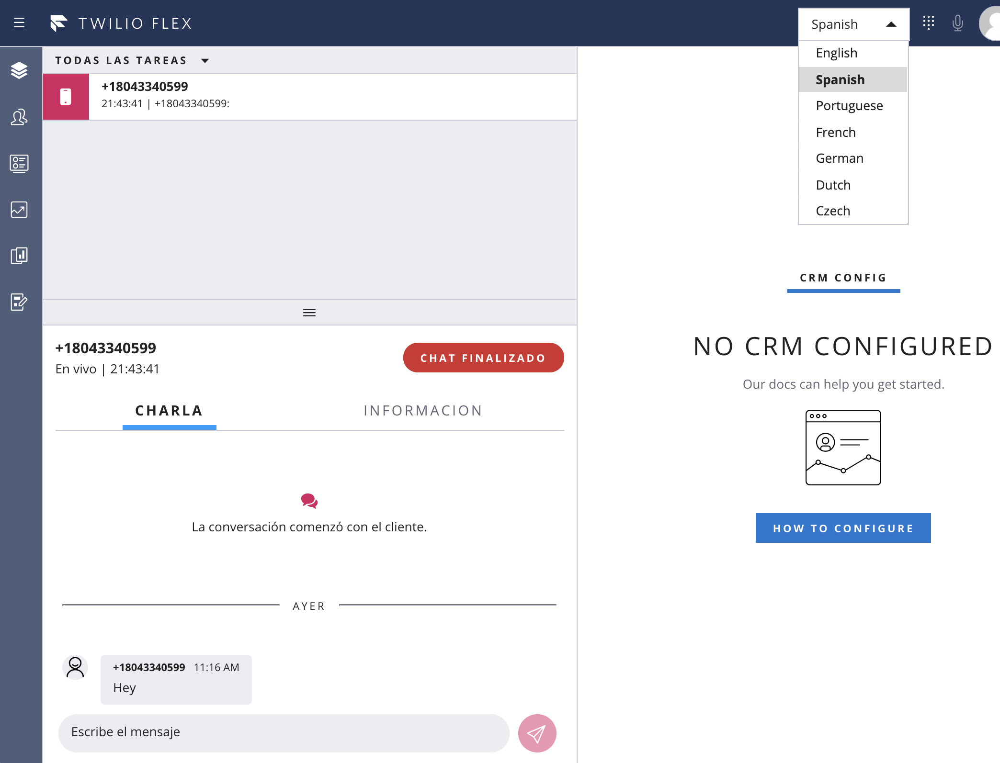
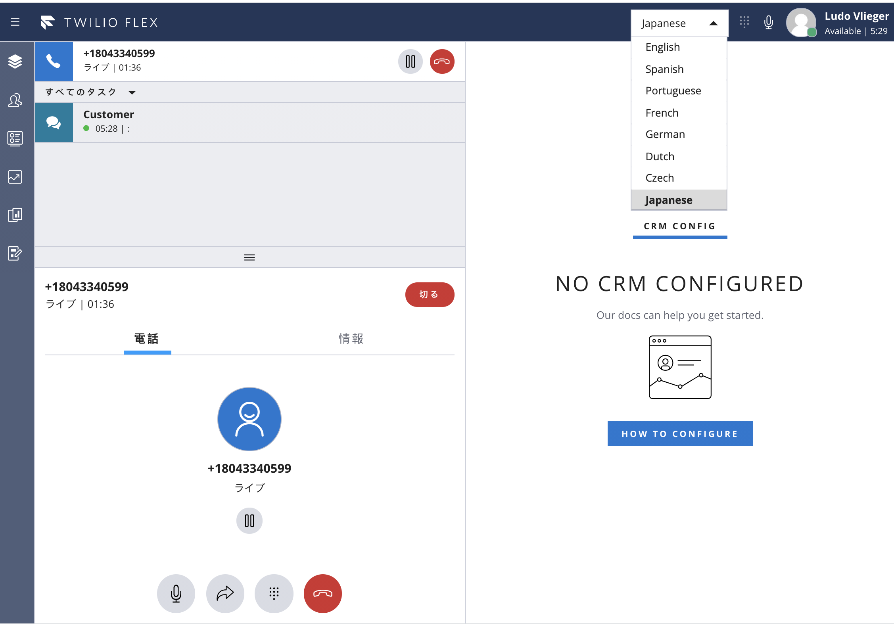

<a  href="https://www.twilio.com">

</a>

# Twilio Flex Plugin - Localization using Twilio Serverless Functions

Twilio Flex Plugins allow you to customize the appearance and behavior of [Twilio Flex](https://www.twilio.com/flex). If you want to learn more about the capabilities and how to use the API, check out our [Flex documentation](https://www.twilio.com/docs/flex).

This plugin replaces all string prompts in the Flex UI with translations, localizing the UI to each logged-in user. This plugin also provides a Language Selection menu for the agents. Switching language reloads the appropriate language file and updates all the Flex Manager Template Strings





Available Languages:
* English
* Spanish
* Portuguese
* French
* German
* Dutch
* Czech
* Japanese
* Chinese (Simplified)

The included assets contain the translated template strings for each Language. Each file contains the exact same set of String Identifiers since this is required for seamless Language switching.

## Setup

Make sure you have [Node.js](https://nodejs.org) as well as [`npm`](https://npmjs.com). We support Node >= 10.12 (and recommend the _even_ versions of Node). Afterwards, install the dependencies by running `npm install`:

```bash
cd 

# If you use npm
npm install
```

Next, please install the [Twilio CLI](https://www.twilio.com/docs/twilio-cli/quickstart) by running:

```bash
brew tap twilio/brew && brew install twilio
```

Finally, install two plugins to the Twilio CLI.

[Flex Plugin extension](https://www.twilio.com/docs/flex/developer/plugins/cli/install) for the Twilio CLI:

```bash
twilio plugins:install @twilio-labs/plugin-flex
```

[Serverless Plugin extension](https://www.twilio.com/docs/labs/serverless-toolkit) for the Twilio CLI:

```bash
twilio plugins:install @twilio-labs/plugin-serverless
```

## Adding additional languages 

Run `twilio flex:plugins --help` and `twilio serverless --help` to see all the commands we currently support. For further details on CLI Plugins refer to our documentation on the [Twilio CLI Plugins Docs](https://www.twilio.com/docs/twilio-cli/plugins) page.

Start Flex using the Chrome browser, to create a new, full copy of the Twilio Flex Strings object.  Once Flex is loaded, open the Chrome Developer Tools, and type this into the console:

```bash
copy(Twilio.Flex.Manager.getInstance().strings)
```

Open the en-US.private.json file in the default/assets directory, remove all existing lines and paste in the contents of the clipboard.  Save and close the file.

Make a copy of en-US.private.json file for every language to be used - samples for es-MX.private.json and fr-CA.private.json show the naming convention: {ISO Language and Country Code}.private.json

Translate all entries in the JSON file for the new language.

Alternatively, leverage the spreadsheet provided to create new language assets. See worksheet for details and instructions.

In the `default` directory, deploy the Serverless Function and Assets.

```bash
twilio serverless:deploy --override-existing-project
```
Note the Domain displayed in the command output. Copy this value.

In the base project directory copy the .env.sample file to .env, and add this value (from the previous step):

FLEX_APP_FUNCTIONS_BASE=https://YOUR-DOMAIN.twil.io


In the base project directory, deploy the Flex Plugin.

```bash
twilio flex:plugins:deploy --changelog "add your comment"
```

Note the instructions in the command output - the next command to run is supplied.  Copy and paste it, and run it to activate this release of the Plugin.

There are comments in the source code for src/FlexLocalizationPlugin.js describing how to determine which Language Asset file to load.  Review those, and the rest of the code, and configure Flex Users with their language settings.

Close all browsers with Flex running, and open a new browser window to start Flex.

For further reference see [Flex Localization and Templating](https://www.twilio.com/docs/flex/developer/ui/localization-and-templating)

If necessary, run `npm install twilo-flex-token-validator` for dependencies in both base project directory and the `default` directory!

## License

[MIT](http://www.opensource.org/licenses/mit-license.html)

## Disclaimer

No warranty expressed or implied. Software is as is.
